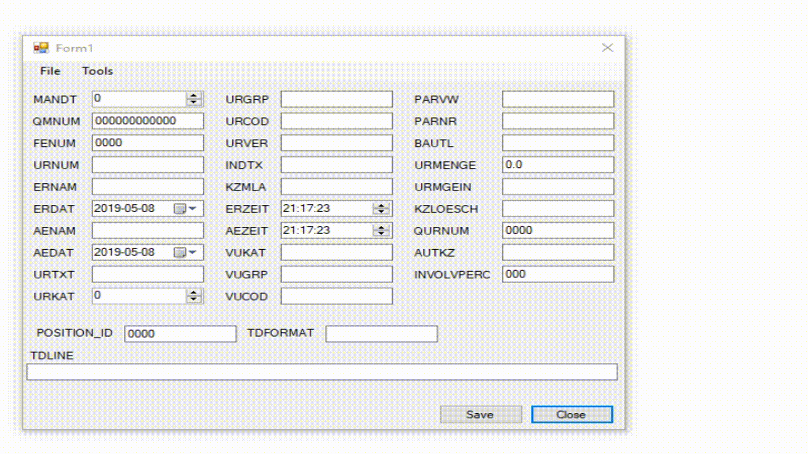

Лабораторная работа демонстрирует использование контрола `TableLayout` и свойства `AutoSize` визуальных контролов  для автоматического выравнивания этих контролов на форме. Что очень актуально при изменении языка интерфейса, когда длина текста в  контролах `Lable` изменяется.

